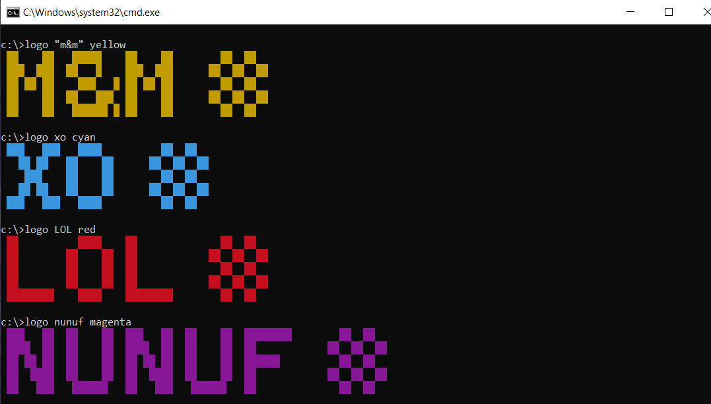

# cli-colored-logo

This cli allows you to enter any text and one of seven colors of your choice and prints out a colored console-like logo.

<br/>

## Usage

```
logo <TEXT> <COLOR>
```
<br/>

##### TEXT
Any text of your choice
<br/><br/>
##### COLOR
Can have one of the following options (case-insensitive):<br/>
`RED`<br/>
`GREEN`<br/>
`YELLOW`<br/>
`BLUE`<br/>
`MAGENTA`<br/>
`CYAN`<br/>
`WHITE (default)`<br/>

<br/>

## Preview



<br/>

## License

MIT © 2022